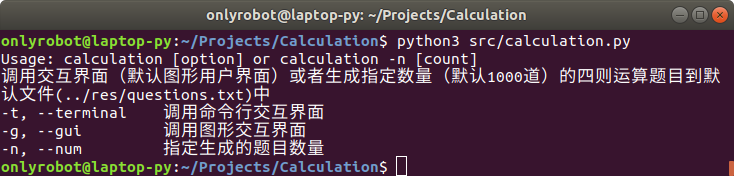
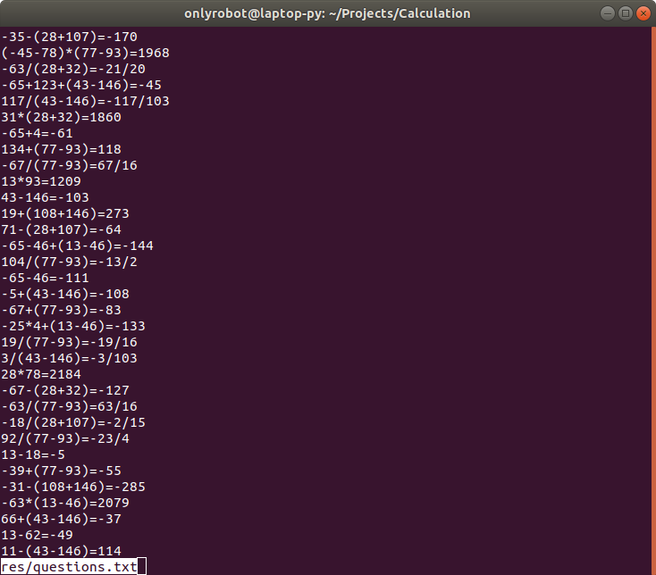
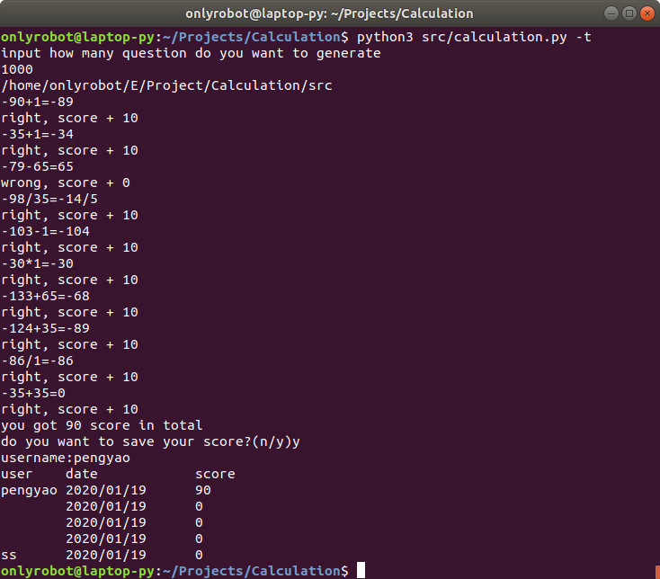
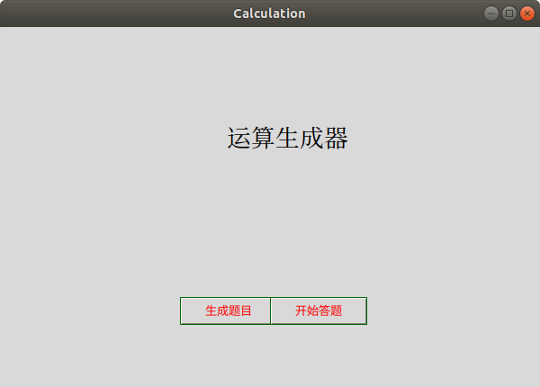
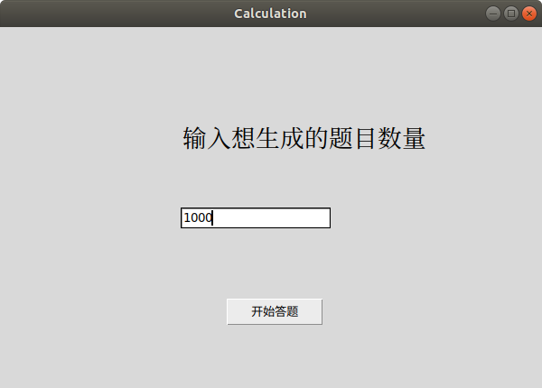
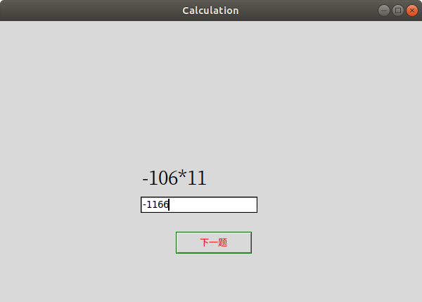
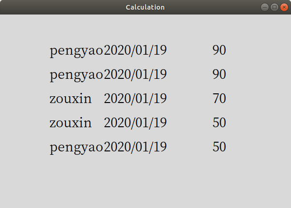

# 目录

1. [需求分析](#需求分析)
2. [软件设计](#软件设计)
3. [代码实现](#最终效果)
4. [软件测试](#软件测试)
5. [最终效果](#最终效果)

## 需求分析

1. 能够自动生成小学四则运算题目
2. 输入命令可以自动生成一千道不重复的题目，并写入到文件备用，不重复的定义为如下：
    > 任何两道题不能通过有限次的+和×左右的运算表达变换为同一道题。例如23+45=和45+23=是重复的题，6×8=和8×6=也是重复的题，类似的多个数字之间如果存在这种关系也不是同一道题，如3+1+2=和1+2+3=也是重复的。
3. 能够对表达式进行求值并有以下要求：
   1. 表达式最多可达10个运算符，括号的数量不限
   2. 除了整数以外还要支持真分数的四则运算。（例如1/6+1/8=7/24）
   3. 程序可以接受用户输入的答案，并判定对错，最后给出总对/错数量。
4. 除四则运算外还支持乘方运算，乘方运算的表达方式有两种，分别是"^"和"**"，要求对两种表达方式都可以支持，并能够通过设置来选择其中一种作为当前表达方式。
5. 用Python语言实现跨平台的图形界面，同时增加“倒计时”功能，每个题目必须在20秒钟以内完成，如果完不成，记0分，并进入下一题。
6. 增加“历史记录”功能，把用户的做题成绩记录下来并可以展现历史记录。
7. 对程序进行有效测试，保证可靠性。

## 软件设计

概要：

* 软件名称：Calculation
* 项目地址：[Github地址](https://github.com/onlyrobot/Calculation)

运行环境/软件配置：

* 编程语言：Python3.7
* 操作系统：Windows10/Linux18.04/Mac
* 代码编辑器：Visual Studio Code
* 性能要求：无

模块结构：

|模块名称     |主要功能|
|-------     |--------|
|expression  |定义了表达式的表示方法、如何将表达式转化成字符串、表达式求值等|
|utilities   |包含处理一些封装好的实用工具，如生成表达式、设置配置、读取配置等|
|terminal    |负责命令行界面交互过程|
|gui         |负责GUI的显示和交互|
|calculation |主调函数，根据参数的不同决定使用命令行还是图形界面|

数据文件：

|文件名         |用途|
|--------------|----------------|
|questions.txt |保存生成好的1000个题目|
|score.dat     |保存历史成绩记录|
|setting.config|保存软件配置信息|

面向对象编程：

|class: expression::Operator(Enum)|枚举类型，包含了所有支持的运算符（在表达式中充当root）|
|---------------------------------|---------------------------|
|+add=(priority=0, function=add, symbol) |加法运算，枚举对象的取值为优先级、函数对象和符号组成的三元组|
|+minus=(priority=0, function=minus, symbol) |减法运算，枚举对象的取值为优先级、函数对象和符号组成的三元组|
|+multiply=(priority=1, function=multiply, symbol) |乘法运算，枚举对象的取值为优先级、函数对象和符号组成的三元组|
|+divide=(priority=1, function=divide, symbol) |除法运算，枚举对象的取值为优先级、函数对象和符号组成的三元组|
|+power=(priority=2, function=power, symbol) |乘方运算，枚举对象的取值为优先级、函数对象和符号组成的三元组|

|class: expression::Expression   |用树型结构表示表达式的对象，如1表示为：树根=1，左节点闲置，右节点闲置；2表示为树根=2，左节点闲置，右节点闲置；1+2表示为：树根=Operator.add，左节点=上面到1表达式，右节点=上面到表达式2     |
|-------------------------------|--------------|
|-root: Enum/int|根节点，可以由运算符或数值充当|
|-left: Expression|左节点，当根节点是数值时该节点无意义，否则表示表达式的左子节点|
|-right: Expression|右节点，当根节点是数值时该节点无意义，否则表示表达式到右字节点|
|+constructor(root, left, right)|构造函数，参数分别表示根节点、左子表达式、右子表达式|
|+eval(): Expression|计算表达式的值，返回结果是一个表达式（为什么不是单纯的某个数字，因为要支持真分数的运算，而表达式可以表示数字和真分数）|
|+toString(): String|将表达式转换成字符串形式|

函数接口：

|函数名             |用途|参数说明          |返回值说明        |
|-------------------------------------------|----------------|------------------|-----------------|
|utilities::gen_question(int count): list|生成指定数量的四则运算题目到默认的文件|count: 生成题目的数量|
|utilities::set_config(**kwargs): Bool|设置软件的配置参数|键值对组成的字典|返回是否设置成功|
|utilities::get_config(*args): dict|获取软件的配置参数|key值列表|返回获取到的键值对（如果键值对不存在则返回空字典）|
|utilites::save_score(dict): bool|保存得分成绩|时间-成绩的键值对组成的字典|是否保存成功|
|utilities::get_score(float beg, float end): dict|获取历史成绩|开始和结束时间（默认为空）|返回在开始时间和结束时间内的时间-成绩键值对组成的字典|
|terminal::main()|命令行交互界面的主调函数|无|无|
|gui::main()|图形界面的交互界面的主调函数|无|无|
|calculation::main()|程序主调函数|无|无|

主调函数：

* calculation模块
  
> usage: calculation [option]
> or: calculation -n [count] [file]
>
> or: calculation [-n [count]] file
>
> 调用交互界面（默认图形用户界面）或者生成指定数量（默认1000道）的四则运算题目到指定文件file（默认当前目录的questions.txt)中
>
> -t, --terminal    调用命令行交互界面
>
> -g, --gui         调用图形交互界面
>
> -n, --num         指定生成的题目数量

* terminal模块

> usage: terminal
>
> 调用命令交互界面

* gui模块

> usage: gui
>
> 调用图形交互界面

## 代码实现

总共包含了5个代码文件，分别是expression.py/utilities.py/terminal.py/gui.py/calculation.py，每个文件代表前面提到的模块。代码生成的文档如下：

* [expression](../../res/doc/expression.txt)

```python
Help on module expression:

NAME
    expression

DESCRIPTION
    Date: 2019/12/26
    Description: 定义了表达式的表示方法、如何从字符串中解析表达式、表达式求值等

CLASSES
    builtins.object
        Expression
    enum.Enum(builtins.object)
        Operator
    
    class Expression(builtins.object)
     |  表达式类，实现表达式树形表示和求值运算
     |  
     |  Attributes:
     |      root: 根节点，可以由运算符或数值充当
     |      left: 左节点，当根节点是数值时该节点无意义，否则表示表达式的左子节点
     |      right: 右节点，当根节点是数值时该节点无意义，否则表示表达式到右字节点
     |  
     |  Methods defined here:
     |  
     |  __eq__(self, other)
     |      Return self==value.
     |  
     |  __ge__(self, other, NotImplemented=NotImplemented)
     |      Return a >= b.  Computed by @total_ordering from (not a < b).
     |  
     |  __gt__(self, other, NotImplemented=NotImplemented)
     |      Return a > b.  Computed by @total_ordering from (not a < b) and (a != b).
     |  
     |  __init__(self, root, left=None, right=None)
     |      Initialize self.  See help(type(self)) for accurate signature.
     |  
     |  __le__(self, other, NotImplemented=NotImplemented)
     |      Return a <= b.  Computed by @total_ordering from (a < b) or (a == b).
     |  
     |  __lt__(self, other)
     |      Return self<value.
     |  
     |  __str__(self)
     |      将表达式转换成字符串格式
     |  
     |  eval(self)
     |      表达式求值，返回结果为一个表达式
     |  
     |  get_value(self)
     |  
     |  ----------------------------------------------------------------------
     |  Data descriptors defined here:
     |  
     |  __dict__
     |      dictionary for instance variables (if defined)
     |  
     |  __weakref__
     |      list of weak references to the object (if defined)
     |  
     |  ----------------------------------------------------------------------
     |  Data and other attributes defined here:
     |  
     |  __hash__ = None
    
    class Operator(enum.Enum)
     |  An enumeration.
     |  
     |  Method resolution order:
     |      Operator
     |      enum.Enum
     |      builtins.object
     |  
     |  Data and other attributes defined here:
     |  
     |  add = <Operator.add: (0, <function add at 0x7fa2e4f6d598>, '+')>
     |  
     |  divide = <Operator.divide: (1, <function divide at 0x7fa2e4f6d730>, '/...
     |  
     |  minus = <Operator.minus: (0, <function minus at 0x7fa2e4f6d620>, '-')>
     |  
     |  multiply = <Operator.multiply: (1, <function multiply at 0x7fa2e4f6d6a...
     |  
     |  power = <Operator.power: (2, <function power at 0x7fa2e4f6d7b8>, '^')>
     |  
     |  ----------------------------------------------------------------------
     |  Data descriptors inherited from enum.Enum:
     |  
     |  name
     |      The name of the Enum member.
     |  
     |  value
     |      The value of the Enum member.
     |  
     |  ----------------------------------------------------------------------
     |  Data descriptors inherited from enum.EnumMeta:
     |  
     |  __members__
     |      Returns a mapping of member name->value.
     |      
     |      This mapping lists all enum members, including aliases. Note that this
     |      is a read-only view of the internal mapping.

FUNCTIONS
    add(left, right)
        加法运算，支持数值和分数类型
    
    divide(left, right)
        除法运算，支持数值和分数类型，当分母为零时打印错误并退出程序
    
    gcd(x, y)
        求解最大公因数
    
    lcm(x, y)
        求解最小公倍数
    
    main()
    
    minus(left, right)
        减法运算，支持数值和分数类型
    
    multiply(left, right)
        乘法运算，支持数值和分数类型
    
    power(left, right)
        乘方运算，支持数值类型，当涉及到分数时报错并退出程序

FILE
    /home/onlyrobot/E/Project/Calculation/src/expression.py
```

* [utilities](../../res/doc/utilities.txt)

```python
Help on module utilities:

NAME
    utilities

DESCRIPTION
    Date: 2020/1/2
    Description: 处理表达式到使用工具

FUNCTIONS
    check_valid(op, left, right)
        检查将要生成到表达式是否合法
    
    gen_questions(n)
        生成n个不重复的表达式，返回并保存到文件中
    
    get_config(key)
        获取key的配置信息，当不存在时返回None
    
    init_numbers(n, front, back)
        在指定范围内初始化n个数字作为生成表达式到基础
        
        比如随机生成10个0～100中到数字
        
        Args:
            n: 生成多少个数字
            front: 范围开始（包含）
            back: 范围结束（包含）
        
        Returns:
            返回生成的数字列表
    
    main()
    
    product_questions(n, questions, a, b, drop_out)
        由已生成的表达式组合成更复杂的表达式
    
    read_questions()
    
    read_score()
        读取历史分数信息
        
        Returns:
            返回三元组（用户名，时间，获得的分数）组成到列表，每个三元组代表一个历史记录
    
    save_score(scores)
        保存历史分数信息
        
        Args:
            scores: 三元组（用户名，时间，获得的分数）组成的列表
    
    set_config(**kargvs)
        设置配置信息，参数为键值对

FILE
    /home/onlyrobot/E/Project/Calculation/src/utilities.py
```

* [calculation](../../res/doc/calculation.txt)
* [terminal](../../res/doc/terminal.txt)
* [gui](../../res/doc/gui.txt)

## 软件测试

为主要的逻辑模块/函数进行了测试
|函数，模块名|函数，模块说明|测试模块名|等价类划分|
|-------|-----------|-----------|-------------|
|expression|表达式类|expression_test|正常用例;除数为零；乘方中包含分数|
|utilities::gen_questions|生成题目的函数|utilities_test|生成题目；设置配置项；读取配置项；写入分数历史记录；读取分数历史记录|
|utilities::set_config|设置配置信息|utilities_test|配置项组成的键值对|
|utilities::get_config|读取配置|utilities_test|配置项的键key，返回配置项的值value|
|utilities::save_score|保存历史得分信息|utilities_test|用户名，时间，分数组成的三元组|
|utilities::read_score|读取历史分数信息|utilities_test|无参数，返回用户名，时间，分数组成的三元组的列表|

## PSP表格

| PSP2.1           | Personal Software Process Stages  | 预估耗时(分钟) | 实际耗时(分钟)) |
| -----------------| ----------------------------------| -------------- | --------------- |
| Planning         | 计划                              | 120                | 100     |
| *Estimate        | *估计这个任务需要多少时间             | 720             |  700   |
| Development      | 开发                               | 600                | 550    |
| *Analysis        | *需求分析（包括学习新技术）            | 150             |  100   |
| *Design Spec     | *生成设计文档                        | 30               |  20   |
| *Design Review   | *设计复审（和同事审核设计文档）         | 20               |  15   |
| *Coding Standard | *代码规范（为目前的开发制定合适的规范） | 30                 |   55  |
| *Design          | *具体设计                          | 20                 |  70   |
| *Coding          | *具体编码                         | 480                | 300    |
| *Code Review     | *代码复审                         | 60                |  120   |
| *Test            | *测试（自我测试，修改代码，提交修改）   | 120                | 120    |
| Reporting        | 报告                               | 180                   |  180   |
| *Test Report     | *测试报告                           | 60                  | 62    |
| *Size Measurement| *计算工作量                              | 30            |  30   |
| *Postmortem & Process Improvement Plan| *总结，并提出过程改进计划| 50           | 53    |
|                  | 合计                                   | 2670           |  2550   |

## 最终效果

效果展示

命令用法展示：



用命令生成1000个四则运算题目：

`calculation -n 1000`



命令行交互界面：



图形交互界面展示：

主界面：



生成题目界面：



做题界面：



历史分数记录界面：


