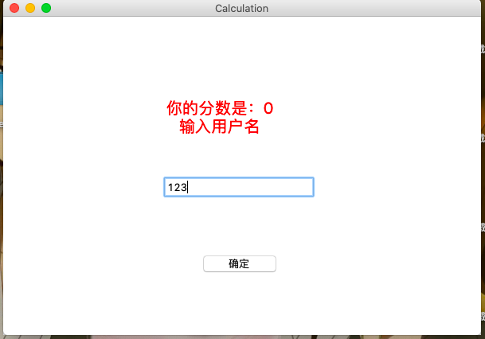

### GUI界面介绍

首先来调用`gui.py`里的gui函数来进入gui界面

其中，主界面里面包含了一开始进入的界面，最后结束的界面，保存分数和展示分数的界面，问题部分是提取保存在文件里问题的界面。每个界面生成一些`label`，`button`，`entry`等.

| PSP2.1                                 | Personal Software Process Stages        | 预估耗时(分钟) | 实际耗时(分钟)) |
| -------------------------------------- | --------------------------------------- | -------------- | --------------- |
| Planning                               | 计划                                    |                |                 |
| *Estimate                              | *估计这个任务需要多少时间               | 720            | 800             |
| Development                            | 开发                                    |                |                 |
| *Analysis                              | *需求分析（包括学习新技术）             | 150            | 160             |
| *Design Spec                           | *生成设计文档                           | 30             | 40              |
| *Design Review                         | *设计复审（和同事审核设计文档）         | 20             | 25              |
| *Coding Standard                       | *代码规范（为目前的开发制定合适的规范） | 30             | 25              |
| *Design                                | *具体设计                               | 20             | 30              |
| *Coding                                | *具体编码                               | 480            | 720             |
| *Code Review                           | *代码复审                               | 60             | 50              |
| *Test                                  | *测试（自我测试，修改代码，提交修改）   | 120            | 150             |
| Reporting                              | 报告                                    |                |                 |
| *Test Report                           | *测试报告                               | 60             | 60              |
| *Size Measurement                      | *计算工作量                             | 30             | 30              |
| *Postmortem & Process Improvement Plan | *事后总结，并提出过程改进计划           | 50             | 60              |
|                                        | 合计                                    | 1050           | 1370            |

### 最终展示

### 命令行：

### GUI：

主界面：

生成题目：

生成后弹出生成完成窗口：

回答问题界面：

结束答题：

输入需要保存记录用户名：

保存完成弹出提示窗口：

展示最近的历史分数记录界面：

### 